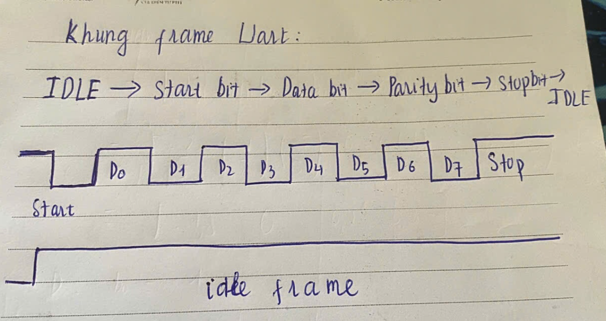

# ELE_D23_PHAM_ANH_TU

## A. Tìm hiểu cơ bản về UART

### I. UART là gì ?

- là 1 khối phần cứng giao tiếp nối tiếp được tích hợp trong VDK OR VXL --> truyền và nhận dữ liệu

dạng bit nối tiếp giữa các thiết bị 

- Uart have a task : 

    + Chuyển dữ liêu song song bên trong CPU (8/16 bit) 
        
        --> thành dữ liệu nối tiếp từng bit 1 truyền ra bên ngoài 
    + Và thực hiện truyền ngược lại

- Uart hoạt động theo kiểu asynchronous (ko đồng bộ) 

    + không dùng xung clock giữa 2 thiết bị nhận và gửi

    + mà sẽ truyền theo frame , baud rate , số bit data, stop bit ...

### II. What are TX,RX,baud rate , start / stop bits and pariity ? What is its purpose ?

 1) TX and RX 
    
    + TX : chân phát tín hiệu (data)

        + Là chân xuất tín hiệu ra , dùng để gửi data from STM32

        + In stable IDLE (don't transmit) : TX awlays stay at HIGH(1)


    + RX : Chân nhận tín hiệu

        + Là chân đầu vào nhận tín hiệu từ các equipment outside

        + Upon detected start bit , start read the data 

    + Goals : 

        + Cho phép gửi và nhận đồng thời , không xung đột

        + TX chỉ phát, RX chỉ nhận , same nghe điện thoại vừa nói , vừa nghe đc

    

 2) Baud Rate ( Tốc độ truyền  )

    + Define : Số bits được truyền trong 1 giây (Bps)

    + Eg: 

        . 9600 bps --> mỗi giây truyền 9600 bit
        
        . Time transmit 1 bit : 1/9600 microseconds

        . 1 số giá trị hay gặp 9600 , 19200, 115200 ...

    + Note : 2 device together 1 baud rate

    + Cách tính baurate trong F103

        ```c
        Baud Rate = fPCLK / (16 × USARTDIV)
        ```

        + fPCLK : Tần số clock cấp cho UART

        + UASRTDIV : Giá trị ghi vào register of BRR
    + Goals : 

        + Đồng bộ tốc độ 2 thiết bị không có clock chung

        + tuyệt đối 2 thiết bị luôn cùng baudrate 

3) Start bit 

- Function : Báo hiệu bắt đầu 1 khung truyền dữ liệu

- Đặc điểm : 

    + luôn là bit 0 (LOW)

    + kéo đường truyền từ IDLE xuống mức thấp

    + giúp bên nhận biết có dữ liệu đến

--> Important : Start bit help bên nhận biết chính xác thời điểm đọc dữ liệu , từ đó sẽ lấy mẫu 

các bít tiếp theo theo đúng khoảng thời gian baud rate 

- Goals :

    + Báo hiệu bắt đầu truyền 

    + bên nhận dễ biết khi nào truyền , phân biệt với IDLE

    + đồng bộ thời gian --> vì 2 thiết bị không có clk chung , nên có thể sai lệch nhỏ 1-3% , 

    nên cần 1 điểm mốc để đồng bộ lại thời gian 

- Cách hoạt động 

        1. Bên nhận liên tục giám sát đường RX ở mức cao (IDLE)

        2. Phát hiện cạnh xuống (1 về 0 ) : có biit start 

        3. Bắt đầu đếm thời gian từ cạnh xuống này:

        - Sau 1.5 bit-time: đọc bit dữ liệu đầu tiên (D0)
        - Sau 2.5 bit-time: đọc D1
        - Sau 3.5 bit-time: đọc D2
        
        4. Mỗi khung dữ liệu có Start bit đến Reset lại thời gian đếm

- Đọc ở giữa các bit 1.5, 2.5 

    + Vì tránh đọc ở biên chuyển đổi , đọc ở giữa là ổn định nhất

- Ngoài ra còn khởi động bộ lấy mẫu (Sampling)

    + Trong STM32, UART có bộ oversampling (thường x16):

        + Clock UART nội bộ nhanh gấp 16 lần baud rate

        + Lấy mẫu 16 lần trong 1 bit-time

        + Start bit kích hoạt bộ lấy mẫu này


4) Stop bit 

- Báo hiệu hết thúc 1 khung truyền

- Đặc điểm :

    + Luôn ở mức cao

    + Đưa đường truyền về trạng thái IDLE

    + Có thể cấu hình : 1 bit , 1.5 bit , 2 bit stop

- Needed : 

    + Tạo khoảng relex giữa các frame truyền

    + Giúp bên nhận có thời gian xử lí dữ liệu 

    + STM32 F103 : thường dùng 1 stop bit

- Goals : sau stop bits có 1 khoảng nghỉ

    + Phân biệt rõ ràng với khung dữ liệu

    + Đảm bảo trạng thái IDLE giữa các khung

        + Stop bit = 1

        + để dễ nhận biết start bit tiếp theo

   + thời gian xử lý cho bên nhận để lưu byte vào buffer , ngoặc xử lí ngắt 

   + phát hiện lỗi , khi không đọc đc bits stop ở mức 1 --> do sai baudrate hoặc mất đường truyền


5) Bit kiểm tra chẵn lẻ ( Parity bit)

- phát hiện lỗi trong quá trình truyền 

- 1 số loại Parity

    + None : Ko có bit kiểm tra lỗi , tiết kiệm năng lượng

    + Parity chẵn : 

        + nếu số bit 1 lẻ --> parity bit = 1

        + nếu số bit 1 chẵn --> parity bit = 0

        + Goals : Tổng số bit 1 ( kể cả parity ) luôn là số chẵn

        + Eg: 0b1011 ( có tổng là 4 bit 1 )

    + Parity lẻ :

        + ngược lại với parity chẵn

    + Limitation : chỉ phát hiện được 1 lỗi bit , ko sửa được chỉ báo lỗi

- Goals :

    + Phát hiện lỗi trong frame truyền 

    + tuy nhiên ít được dùng về chỉ phát hiện ko sửa , tốn time truyền 

6) Khung frame của UART




